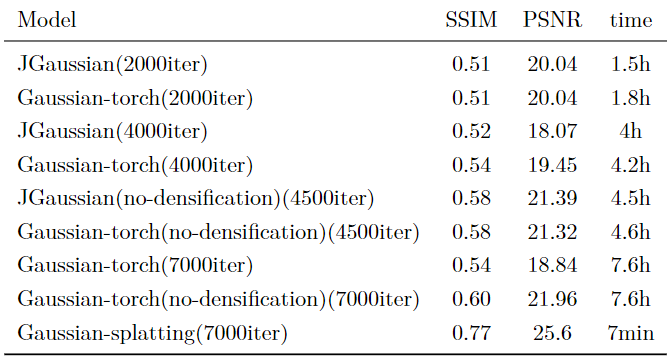

# JGaussian
Use Jittor to recurrent Gaussain Splatting

Project is in the process...  

## How to use?

This project is mainly based on official implemention of Gaussian Spaltiing, so a lot of args is similar to official implemention

### Train

```shell
python train.py -s <path to COLMAP or NeRF Synthetic dataset>
```

<details>
<summary><span style="font-weight: bold;">Command Line Arguments for train.py</span></summary>

  #### --source_path / -s
  Path to the source directory containing a COLMAP or Synthetic NeRF data set.
  #### --model_path / -m 
  Path where the trained model should be stored (```output/<random>``` by default).
  #### --images / -i
  Alternative subdirectory for COLMAP images (```images``` by default).
  #### --eval
  Add this flag to use a MipNeRF360-style training/test split for evaluation.
  #### --resolution / -r
  Specifies resolution of the loaded images before training. If provided ```1, 2, 4``` or ```8```, uses original, 1/2, 1/4 or 1/8 resolution, respectively. For all other values, rescales the width to the given number while maintaining image aspect. **If not set and input image width exceeds 1.6K pixels, inputs are automatically rescaled to this target.**
  #### --data_device
  Specifies where to put the source image data, ```cuda``` by default, recommended to use ```cpu``` if training on large/high-resolution dataset, will reduce VRAM consumption, but slightly slow down training. Thanks to [HrsPythonix](https://github.com/HrsPythonix).
  #### --white_background / -w
  Add this flag to use white background instead of black (default), e.g., for evaluation of NeRF Synthetic dataset.
  #### --sh_degree
  Order of spherical harmonics to be used (no larger than 3). ```3``` by default.
  #### --convert_SHs_python
  Flag to make pipeline compute forward and backward of SHs with PyTorch instead of ours.
  #### --convert_cov3D_python
  Flag to make pipeline compute forward and backward of the 3D covariance with PyTorch instead of ours.
  #### --debug
  Enables debug mode if you experience erros. If the rasterizer fails, a ```dump``` file is created that you may forward to us in an issue so we can take a look.
  #### --debug_from
  Debugging is **slow**. You may specify an iteration (starting from 0) after which the above debugging becomes active.
  #### --iterations
  Number of total iterations to train for, ```30_000``` by default.
  #### --test_iterations
   Intervals to computes L1 and PSNR over test set, ```500``` by default.
  #### --save_iterations
   Intervals to saves the Gaussian model, ```500 <iterations>``` by default.
  #### --checkpoint_iterations
  Intervals to store a checkpoint for continuing later, saved in the model directory.```500 <iterations>``` by default.
  #### --start_checkpoint
  Path to a saved checkpoint to continue training from.
  #### --quiet 
  Flag to omit any text written to standard out pipe. 
  #### --feature_lr
  Spherical harmonics features learning rate, ```0.0025``` by default.
  #### --opacity_lr
  Opacity learning rate, ```0.05``` by default.
  #### --scaling_lr
  Scaling learning rate, ```0.005``` by default.
  #### --rotation_lr
  Rotation learning rate, ```0.001``` by default.
  #### --position_lr_max_steps
  Number of steps (from 0) where position learning rate goes from ```initial``` to ```final```. ```30_000``` by default.
  #### --position_lr_init
  Initial 3D position learning rate, ```0.00016``` by default.
  #### --position_lr_final
  Final 3D position learning rate, ```0.0000016``` by default.
  #### --position_lr_delay_mult
  Position learning rate multiplier (cf. Plenoxels), ```0.01``` by default. 
  #### --densify_from_iter
  Iteration where densification starts, ```500``` by default. 
  #### --densify_until_iter
  Iteration where densification stops, ```15_000``` by default.
  #### --densify_grad_threshold
  Limit that decides if points should be densified based on 2D position gradient, ```0.0002``` by default.
  #### --densification_interval
  How frequently to densify, ```100``` (every 100 iterations) by default.
  #### --opacity_reset_interval
  How frequently to reset opacity, ```3_000``` by default. 
  #### --lambda_dssim
  Influence of SSIM on total loss from 0 to 1, ```0.2``` by default. 
  #### --percent_dense
  Percentage of scene extent (0--1) a point must exceed to be forcibly densified, ```0.01``` by default.

</details>
<br>

### Render and Metrics


```shell
python render.py -m <path to pre-trained model> -s <path to COLMAP dataset>
python metrics.py -m <path to pre-trained model>
```

<details>
<summary><span style="font-weight: bold;">Command Line Arguments for render.py</span></summary>

  #### --model_path / -m 
  Path to the trained model directory you want to create renderings for.
  #### --skip_train
  Flag to skip rendering the training set.
  #### --skip_test
  Flag to skip rendering the test set.
  #### --quiet 
  Flag to omit any text written to standard out pipe. 

  **The below parameters will be read automatically from the model path, based on what was used for training. However, you may override them by providing them explicitly on the command line.** 

  #### --source_path / -s
  Path to the source directory containing a COLMAP or Synthetic NeRF data set.
  #### --images / -i
  Alternative subdirectory for COLMAP images (```images``` by default).
  #### --eval
  Add this flag to use a MipNeRF360-style training/test split for evaluation.
  #### --resolution / -r
  Changes the resolution of the loaded images before training. If provided ```1, 2, 4``` or ```8```, uses original, 1/2, 1/4 or 1/8 resolution, respectively. For all other values, rescales the width to the given number while maintaining image aspect. ```1``` by default.
  #### --white_background / -w
  Add this flag to use white background instead of black (default), e.g., for evaluation of NeRF Synthetic dataset.
  #### --convert_SHs_python
  Flag to make pipeline render with computed SHs from PyTorch instead of ours.
  #### --convert_cov3D_python
  Flag to make pipeline render with computed 3D covariance from PyTorch instead of ours.

</details>

<details>
<summary><span style="font-weight: bold;">Command Line Arguments for metrics.py</span></summary>

  #### --model_paths / -m 
  Space-separated list of model paths for which metrics should be computed.
</details>
<br>

## Datasets

Noticed that because of CUDA memory , we all reduce the image resolution to 0.125 by using args of "-r" "8", but if you may force training to use your higher-resolution images by setting ```-r 1```.

The MipNeRF360 scenes are hosted by the paper authors [here](https://jonbarron.info/mipnerf360/).


### Visialize

After your training , if you want it to look in web , you can download your output folders' .ply file and drag it to [there](https://antimatter15.com/splat/) to look it in the 3D scene .


## Results

the rusults is like below , notice that all test is finished in TITANXP,We believe that the reason for the decline in rendering quality after adding densification is that the Guassian points are not densified but are constantly pruned due to inappropriate densification parameters. This is also the focus of the next step of parameter adjustment.




compare to purely pytorch Gaussian-splatting [Gaussian_torch](https://github.com/xiazhi1/Gaussian_torch)


JGaussian is faster which shows jittor's strength in speed

compare to official Gaussian-splatting [https://github.com/graphdeco-inria/gaussian-splatting](https://github.com/graphdeco-inria/gaussian-splatting)


CUDA rasterizer is more faster and better than pytorch or jittor rasterizer.

## Reference

[https://github.com/graphdeco-inria/gaussian-splatting](https://github.com/graphdeco-inria/gaussian-splatting)

[https://github.com/hbb1/torch-splatting](https://github.com/hbb1/torch-splatting)

[https://github.com/Jittor/jittor](https://github.com/Jittor/jittor)

[https://github.com/antimatter15/splat](https://github.com/antimatter15/splat)

[Gaussian_torch](https://github.com/xiazhi1/Gaussian_torch)
